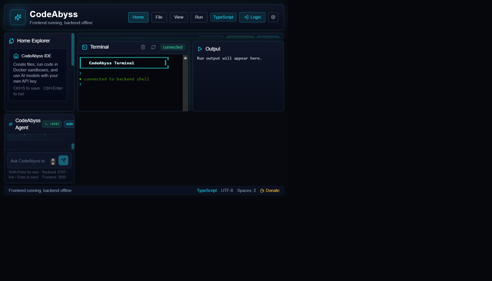

<p align="center">
  
</p>

<h1 align="center">CodeAbyss – Free AI Cloud IDE & Online Compiler</h1>

<p align="center">
  <strong>Write, run, and deploy code in 8+ languages with an autonomous AI coding agent. 100% free. No signup required.</strong>
</p>

<p align="center">
  <a href="https://codeabyss.vercel.app"></a>
  <a href="LICENSE"></a>
  <a href="https://github.com/AbyssalCoder/CodeAbyss_AI_IDE/stargazers"></a>
</p>

<p align="center">
  
  
  
  
  
  
</p>

---

## 🎬 Demo

<p align="center">
  
  <br/>
  <em>The full IDE — Monaco editor, terminal, AI agent, file explorer, live preview</em>
</p>

### ✨ Key Highlights

| Feature | Description |
|---------|-------------|
| 🧠 **AI Coding Agent** | Describe what you want → AI builds the full project |
| 💻 **8+ Languages** | Python, JavaScript, TypeScript, C, C++, Java, Rust, HTML/CSS |
| 🐳 **Docker Sandbox** | Isolated code execution with CPU/RAM limits |
| ⚡ **Zero Setup** | Open the URL → start coding. No downloads, no signup |
| 🎨 **VS Code Editor** | Monaco Editor with IntelliSense, syntax highlighting, themes |
| 🖥️ **Live Terminal** | Full WebSocket terminal with xterm.js |
| 👁️ **Live Preview** | Instant HTML/CSS/JS preview in embedded iframe |
| 🔑 **Bring Your Own Key** | Use your own API keys for unlimited AI |
| 🌙 **Dark Neon UI** | Beautiful animated interface with Framer Motion |
| 📱 **Responsive** | Works on desktop, tablet, and mobile |

---

## 🚀 Try It Now

**Live:** [**codeabyss.vercel.app**](https://codeabyss.vercel.app)

No signup. No credit card. Just open and code.

---

## 🛠️ Self-Host (5 minutes)

### Prerequisites
- Node.js 22+
- Docker Desktop (optional, for sandbox)

### Quick Start

```bash
git clone https://github.com/AbyssalCoder/CodeAbyss_AI_IDE.git
cd CodeAbyss_AI_IDE
npm install
cp .env.example .env
npm run dev
```

| Service | URL |
|---------|-----|
| 🌐 Web IDE | http://localhost:3000 |
| ⚙️ Node API | http://localhost:8787/health |
| 🐍 Python API | http://localhost:8788/health |

### Docker (one command)

```bash
docker compose up
```

---

## 🤖 AI Configuration

CodeAbyss supports 3 AI providers. **Auto mode** cascades: Gemini → OpenRouter → Ollama.

### Free AI (Zero Cost)

| Provider | How to get key | Env variable |
|----------|---------------|--------------|
| **Gemini** | [aistudio.google.com](https://aistudio.google.com/app/apikey) | `GEMINI_API_KEYS=your-key` |
| **OpenRouter** | [openrouter.ai](https://openrouter.ai) | `OPENROUTER_API_KEYS=key1,key2` |

### Local AI (Fully Offline)

```bash
ollama pull qwen2.5-coder:7b
ollama serve
```

```env
AI_PROVIDER=auto
OLLAMA_BASE_URL=http://127.0.0.1:11434
```

---

## 🏗️ Architecture

```
┌─────────────────────────────────────────────────┐
│                   Browser                        │
│  ┌──────────────────────────────────────────┐   │
│  │   Next.js 15 Frontend (Vercel)           │   │
│  │   Monaco Editor · xterm.js · Framer      │   │
│  └──────────────┬───────────────────────────┘   │
│                 │ REST + WebSocket               │
└─────────────────┼───────────────────────────────┘
                  │
┌─────────────────▼───────────────────────────────┐
│   Express API (Render)                           │
│   ┌────────┐ ┌──────────┐ ┌──────────────────┐ │
│   │ SQLite │ │ Terminal │ │ Docker Sandbox   │ │
│   │   DB   │ │   WS     │ │ (code execution) │ │
│   └────────┘ └──────────┘ └──────────────────┘ │
│   ┌──────────────────────────────────────────┐  │
│   │ AI Agent (Gemini / OpenRouter / Ollama)  │  │
│   └──────────────────────────────────────────┘  │
└─────────────────────────────────────────────────┘
```

---

## 🐳 Docker Sandbox

```bash
./scripts/setup-compilers.ps1
```

- 🔒 Network disabled (no internet for user code)
- ⚡ 1 CPU / 512 MB RAM limit
- ⏱️ 30-second execution timeout
- 📁 Per-project workspace volume
- ✅ Command allowlist

---

## 🔒 Security

- SQL injection protection (parameterized queries)
- Command injection prevention
- WebSocket terminal authentication
- Helmet.js security headers
- JWT auth with token blacklisting
- Rate limiting on all endpoints
- Sandbox network isolation

> ⚠️ **Never commit real API keys.** Use `.env` files only.

---

## 🌐 Free Deployment

| Component | Platform | Cost |
|-----------|----------|------|
| Frontend | [Vercel](https://vercel.com) | $0 |
| Backend | [Render](https://render.com) | $0 |
| Database | SQLite (embedded) | $0 |
| AI | Gemini / OpenRouter free tiers | $0 |

**Total monthly cost: $0**

See [docs/FREE_DEPLOYMENT.md](docs/FREE_DEPLOYMENT.md) for the full guide.

---

## 🗂️ Project Structure

```
apps/web/              → Next.js 15 frontend
  src/components/      → IDE, editor, terminal, agent panels
  src/lib/             → Config, utilities
services/api-node/     → Express API + SQLite
  src/                 → AI, auth, sandbox, terminal, workspace
services/api-python/   → FastAPI analysis service
demo-projects/         → Starter code for all 8 languages
docs/                  → Screenshots, deployment guide, marketing
scripts/               → Setup scripts, smoke tests
```

---

## 📊 Tech Stack

| Layer | Technology |
|-------|-----------|
| Frontend | Next.js 15, React 19, TypeScript, Tailwind CSS |
| Editor | Monaco Editor (VS Code engine) |
| Terminal | xterm.js + WebSocket |
| Backend | Express 4, Node.js 22 |
| Database | SQLite (via node:sqlite) |
| AI | Google Gemini, OpenRouter, Ollama |
| Sandbox | Docker with resource limits |
| Animation | Framer Motion |
| Auth | JWT + bcrypt |
| Deploy | Vercel + Render (free tier) |

---

## 🤝 Contributing

1. Fork the repo
2. Create a feature branch (`git checkout -b feature/amazing-feature`)
3. Commit changes (`git commit -m 'Add amazing feature'`)
4. Push (`git push origin feature/amazing-feature`)
5. Open a Pull Request

All PRs require review before merge (branch protection enabled).

---

## ⭐ Support

If CodeAbyss helps you, star the repo — it helps others find it!

[](https://github.com/AbyssalCoder/CodeAbyss_AI_IDE)

---

## 📝 License

[MIT](LICENSE) — free for personal and commercial use.

---

<p align="center">
  Built with ❤️ by <a href="https://github.com/AbyssalCoder">AbyssalCoder</a>
  <br/><br/>
  <a href="https://codeabyss.vercel.app"><strong>🌐 codeabyss.vercel.app</strong></a>
</p>
